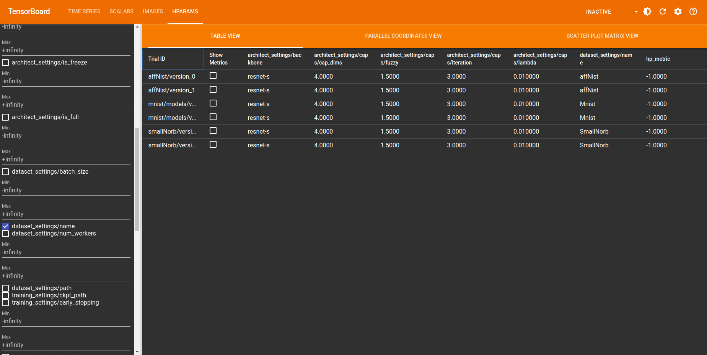
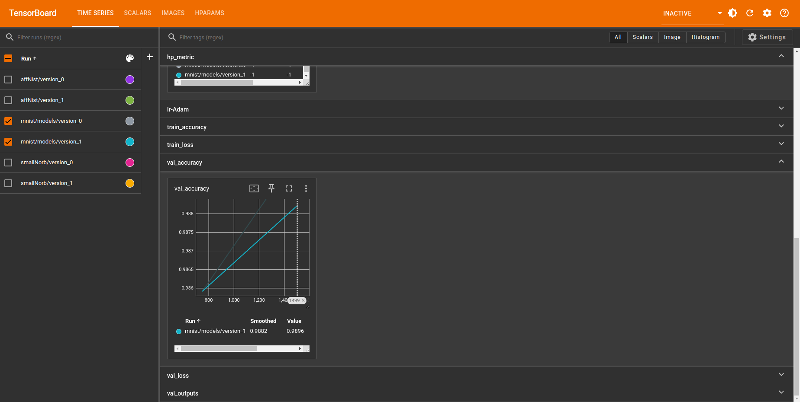
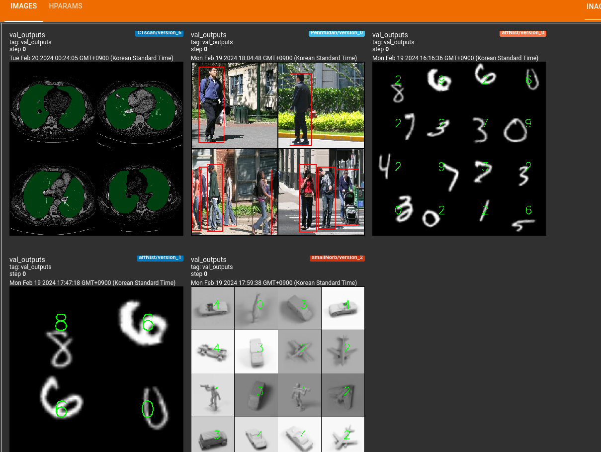
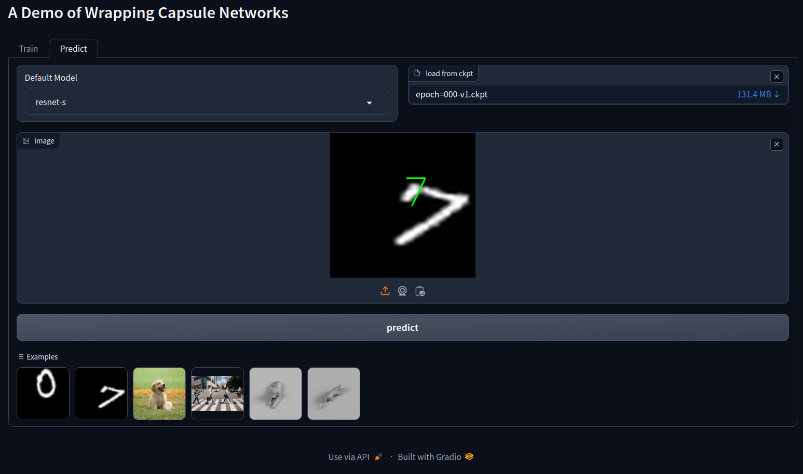

# Encapsulate Capsule Layers
This project from IE laboratory, Chonnam National University
## Environments Settings
### prequisite
- Python>=3.9
- CUDA: 11.8/12.1
- Pytorch framwork: 1.13.1/2.2.0, pytorch-lightning
- Others: numpy, opencv, scipy
- dashboard: tensorboard (for training), gradio (for testing)
1. Install [Anaconda](https://www.anaconda.com/)
- create a new environment:
```
conda create --name=ENV_NAME python=3.11
conda activate ENV_NAME
```
2. Clone the repository:
```bash
git clone https://github.com/Ka0Ri/Capsule-Wrapping.git
```
3. Install torch (check device compatible and follow the tutorial [here](https://pytorch.org/))
  
4. Install dependencies: 
```bash
pip install -r requirements.txt
```

## Model
1. We implement Capsule Layers and Routing methods in `./src/models/layers/CapsuleLayer.py`
- `Routing`: Implement 3 routing methods: [EM](), [Dynamic](), and [Fuzzy](). Algorithm's details are provided in [pdf](Algorithm.pdf)
- `CapsuleLayer`: Implement [2D ConvCaps](), [Primary Capsules](), and [Efficient DepthWise Capsule]().
- `Capsule Head`: To wrap a pretrained models with Capsule Head, we implement [Capsule Head]() class, Capsule Head's role mainly for classification purpose.
1. We implement wrapping module for classification, detection and segmentation using capsule-based network.
- `Classifier.py`: [CapsuleWrappingClassifier]() Wrapping of Capsule Head for classification task.
- `Detector.py`: [CapsuleWrappingDetector]() Wrapping of Capsule Head for object detection task.
- `Segment.py`: [CapsuleWrappingSegment]() Wrapping of Capsule Head for semantic segmentation task.


Utilizing the previously established modules, we proceed to construct a Wrapping Capsule Head designed for three primary vision tasks. The Wrapping Capsule Head comprises the key implementation component of this project. It facilitates three distinct modes of operation: (1) inference utilizing the complete model, (2) fine-tuning with a particular class within the standard layers, and (3) fine-tuning with a specific implementation employing the Capsule Head. Table 1 presents comprehensive information regarding the supported models, while the subsequent section outlines the configurations to be provided.

<table>
<tr>
<td colspan=1>
    Table 1. Supported models
</td>

| Name  | Description |Metrics | Params |
| ------------- | ------------- | ------------- | ------------- |
| `Classification` | None| Accuracy | milions |
| resnet | [ResNet](https://arxiv.org/abs/1512.03385)  | 93.33  | s: 11.5, m: 28.0, l: 62.6 |
| efficientnet | [Efficient Net v2](https://arxiv.org/abs/2104.00298)  | 95.46  | s: 21.9, m: 54.6, l: 118|
| vgg | [Very Deep CNN](https://arxiv.org/abs/1409.1556)  | -  | s: 9.5, m: 9.7, l: 20.3 |
| densenet | [DenseNet](https://arxiv.org/abs/1608.06993)  |  - | s: 8.1, m: 31.7, l: 22.0|
| inception | [Inception v3](https://arxiv.org/abs/1512.00567)  |  - | 29.6 |
| mobilenet | [Mobile Net v3](https://arxiv.org/abs/1905.02244)  | -  | s: 1.3, m:, l: 4.0|
| shufflenet | [Shuffle Net](https://arxiv.org/abs/1807.11164)  |  - | s: 1.5, m: 2.4, l: 9.8 |
| convnext | [ConvNext](https://arxiv.org/abs/2201.03545)  | -  | s: 28.5, m: 88.7, l: 198 |
| vit | [Vision Transformer](https://arxiv.org/abs/2010.11929)  |  - | s: 86.4, m: 304, l: |
| swin | [Swin Transformer](https://arxiv.org/abs/2103.14030)  |  93.17 | s: 28.2, m: 49.5, l: 87.9|
| `Detection` | None| mAP | milions |
| retinanet | [Retina Net](https://arxiv.org/abs/1708.02002)  |  - | m: 32.2, l: 36.4 |
| ssd | [Single Shot Detection](https://arxiv.org/abs/1512.02325)  |  66.43 | s: 3.8, m: 25.4 |
| fasterrcnn |[Faster Region Proposlal CNN](https://arxiv.org/abs/1506.01497)  | 81.16  | s: 20.0, m: 42.4 |
| `Segmentation` | None| dice | milions |
| fcn | [Fully CNN](https://arxiv.org/abs/1411.4038)  |  79.81 | m: 28.0, l: 47.0 |
| deeplab | [Atrous Convolution](https://arxiv.org/abs/1706.05587) | 81.08  | m: 23.5, l: 87.9 |

## Training Interface

We prepared training GUI, with supports:
- Backbone mdoel Selection
- Dataset Selection
- Tunning Hyper-parameters
- Logging with Tensorboard
- Command to start GUI:
```bash
python src/main.py
```
- Using GUI, the train process can be started by clicking `Train` button
  




- Hyper parameters for experimenting with Capsule Network can be tunned using GUI


## Testing Interface

We prepared prediction GUI, with supports:
- Backbone mdoel Selection
- Load from checkpoint `If no checkpoint, the full backbone model will be used`
- Visualize result `Currerntly only show class's index`
- Command to start GUI:
```bash
python src/main.py
```

## Hyperparameters

Refer to the below information to tune hyper parameter for training

<table>
<tr>
<td colspan=1>
    Table 2. Configuration
</td>

| Parameters  | Description |Value |
| ------------- | ------------- |------------- |
| `network settings` |
| Backbone | Backbone Network    | string, refer to Table 1 |
| Is Full | If True, use full model  | Bool |
| Is Freeze | Freeze weights  | Bool |
| Is Caps | Use Capsule head  | Bool |
| `capsule` |
| mode | Mode of Capsule | int: 1 (add a hidden layer), 2 (split channel to get capsule), 3 (split channel and shuffle to get capsule) |
| Cap Dim | Dimension of Cap Vector    | int |
| Routing | Routing Type   | str: "fuzzy", "dynamic", "em" |
| Iteration | number of routing iteration   | int |
| Lambda value | scaling value to avoid numerical error   | float |
| Fuzzy |fuzzy degree, use when fuzzy routing is chosen   | float |
| `dataset settings` |
| Name | Supported dataset, has been implemented  | string: "CIFAR10", "PennFudan", "Mnist", "affNist", "SmallNorb |
| Load Custom Dataset | get the path of Custom dataset, need to be implemented If new dataset   | string |
| batch size | batch size for training   | int |
| number of workers | num workers to dataloader  | int |
| `Training settings` |
| GPU IDs | list of gpus used   | list: [0] |
| loss | loss function   | str: "ce" (classification/segmentation), "bce", "mse", "none"(detection) |
| metric | metric use to evaluate model   | str: "accuracy" (classification), "dice" (segmentation), "map"(detection) |
| Checkpoint Path | path to check-points   | str |
| Log Directory | path to log folder   | str |
| Max epochs | number of epochs using in training   | int |
| Optimizer | optimizer  | str: "adam", "sgd" |
| LR Scheduler | learning rate scheduler   | str: "step", "multistep", "reduce_on_plateau" |
| Early Stopping | early stopping   | bool |
| Monitor | monitoring metirc to get best model   | str |
</tr>


#
## list of papers
- [EM routing](https://openreview.net/pdf?id=HJWLfGWRb)
- [Dynamic routing](https://arxiv.org/pdf/1710.09829.pdf)
- [Shortcut routing](https://search.ieice.org/bin/pdf_link.php?category=A&fname=e104-a_8_1043&lang=E&year=2021)

## list of implementation
- [framework/credit](https://github.com/Ka0Ri/Pytorch-pretrained-models.git)
- [gram-ai/capsule-networks](https://github.com/gram-ai/capsule-networks)
- [danielhavir/capsule-network](https://github.com/danielhavir/capsule-network)
- [XifengGuo/CapsNet-Pytorch](https://github.com/XifengGuo/CapsNet-Pytorch)
- [lidq92/pytorch-capsule-networks](https://github.com/lidq92/pytorch-capsule-networks)
- [jindongwang/Pytorch-CapsuleNet](https://github.com/jindongwang/Pytorch-CapsuleNet)
- [Variational-Capsule-Routing](https://github.com/fabio-deep/Variational-Capsule-Routing)
